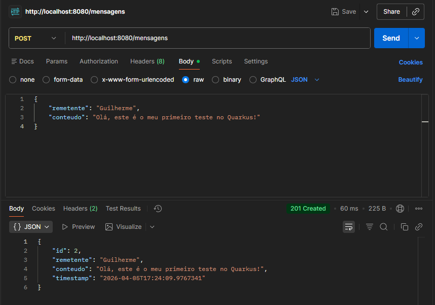

# Relatório Técnico: Sistema de Mensagens Distribuído

Este repositório contém a implementação de uma aplicação distribuída em Quarkus, utilizando HTTP para comunicação direta entre processos.

## 4.1. Arquitetura da Solução

**Fluxo da requisição POST `/mensagens`:**
* **Sender (Cliente):** O Postman atua como o remetente, criando e enviando a requisição com os dados.
* **Receiver (Servidor):** A aplicação Quarkus atua como o destinatário, recebendo a requisição na porta 8080, gerando o ID e salvando na memória.
* **Encapsulamento HTTP:** Os dados (remetente e conteúdo) são formatados em JSON e encapsulados no *Body* (corpo) de uma requisição HTTP POST, sendo transportados pela rede sobre o protocolo TCP.

**Mapeamento Teórico (Send e Receive):**
* **POST:** O cliente faz um **Send** com os dados da nova mensagem. O servidor faz um **Receive**, processa a criação e faz um **Send** de volta confirmando o sucesso.
* **GET:** O cliente faz um **Send** solicitando a leitura de dados. O servidor faz um **Receive** do pedido, busca na memória e faz um **Send** devolvendo a resposta.
* **DELETE:** O cliente faz um **Send** solicitando a exclusão de um ID. O servidor faz um **Receive**, apaga o registro e faz um **Send** com a confirmação.

---

## 4.2. Evidências de Funcionamento

### Tabela de Testes

| Endpoint | Método | Descrição | Evidência (Postman)                    |
| :--- | :--- | :--- |:---------------------------------------|
| `/mensagens` | **POST** | Criação de uma nova mensagem |  |
| `/mensagens` | **GET** | Listagem de todas as mensagens cadastradas |      |
| `/mensagens/{id}` | **GET** | Busca de uma mensagem existente pelo ID |            |
| `/mensagens/{id}` | **GET** | Tentativa de busca por um ID inexistente |         |
| `/mensagens/{id}` | **DELETE** | Exclusão de uma mensagem existente |            |

### Justificativa dos Status Codes Utilizados

* **200 OK:** Retornado nas requisições **GET** e **DELETE**. Indica que a requisição foi recebida e processada com sucesso pelo servidor e que encontrou a lista/mensagem ou conseguiu deletar.
* **201 Created:** Retornado exclusivamente na requisição **POST**. Indica de forma específica que a comunicação foi um sucesso e resultou na criação de um novo recurso na memória.
* **404 Not Found:** Retornado nas requisições **GET** e **DELETE** quando o ID informado na URL não existe no sistema. Indica que a comunicação com o servidor funcionou, mas o dado procurado não foi encontrado.